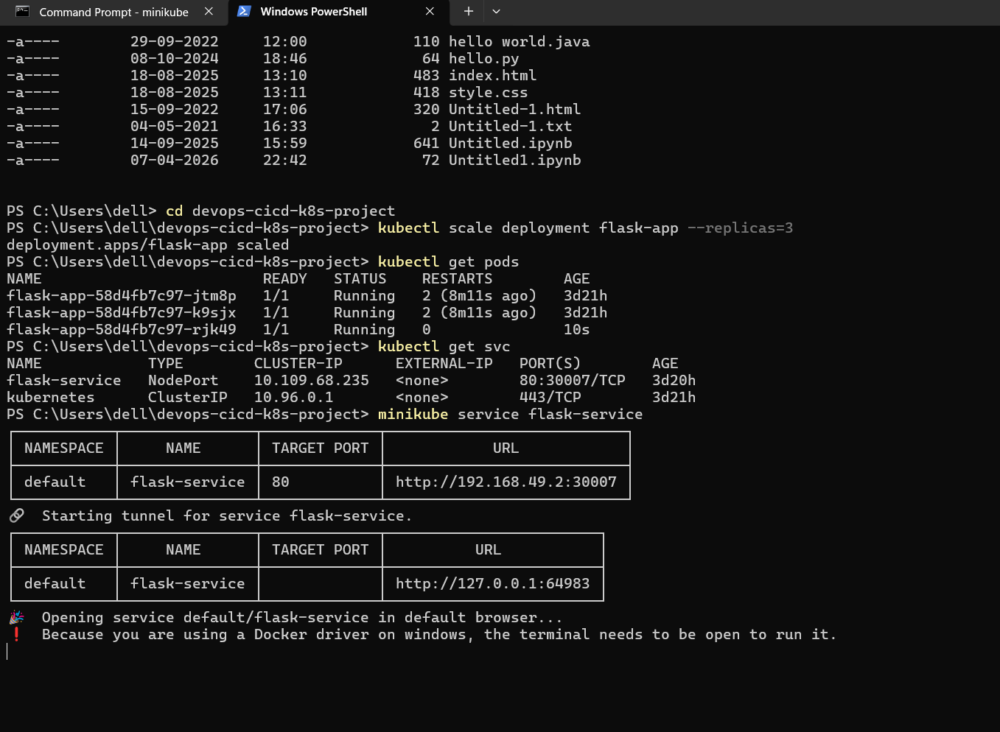

\# DevOps CI/CD Kubernetes Project


\## 📌 Description

This project demonstrates a complete DevOps pipeline:

\- Flask Application

\- Docker Containerization

\- CI/CD using GitHub Actions

\- Kubernetes Deployment


\## 🚀 Features

\- Versioned application

\- Health check endpoint

\- Ready for CI/CD automation


\## 📅 Progress


\### Day 1:

\- Project setup with Flask app

\- Added health endpoint

\- Versioned application


\### Day 2:

\- Dockerized the application

\- Created optimized Dockerfile

\- Built Docker image

\- Ran container successfully


\## ☸️ Kubernetes Setup


\### Deployment

\- Created Deployment with 2 replicas

\- Used labels and selectors


\### Service

\- Exposed using NodePort

\- Accessed via Minikube


\### Scaling

\- Scaled pods from 2 → 4 → 2


\### Commands Used


```bash

kubectl apply -f k8s/deployment.yaml

kubectl apply -f k8s/service.yaml

kubectl get pods

kubectl scale deployment flask-app --replicas=4

---



---